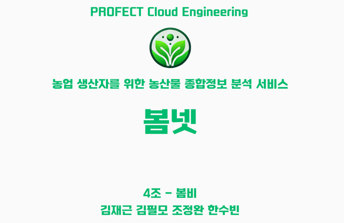

---
#  📝 프로젝트 개요
- ### 프로젝트 이름: 봄넷
- ### 프로젝트 설명: 농업 생산자를 위한 종합 데이터 분석 서비스

# 💻 주요 기능
- **회원가입**:
  - 회원가입 시 DB에 유저정보가 등록됩니다.

- **로그인**:
  - 사용자 인증 정보를 통해 로그인합니다.

- **통합계좌연동**:
  - SMS인증 후 테스트베드 오픈뱅킹 API를 호출하여 사용자의 계좌정보를 받아올 수 있습니다.

- **친구/그룹 관리**:
  - 이메일로 친구를 검색하고 추가/삭제/차단/승인 할 수 있습니다.
  - 정산할 친구들과 일회성/다회성 그룹을 생성할 수 있습니다.

- **일반 송금**:
  - 연동된 계좌에서 대상 계좌로 송금할 수 있습니다.

- **영수증 기반 정산**:
  - 영수증 사진을 인식하여 각 품목별 리스트를 만들고, 품목별 정산인원을 넣거나 뺄 수 있습니다.
  - 품목을 제외하거나 가격을 수정할 수 있습니다.

- **일반 정산**:
  - 금액을 기준으로 1/N 정산을 진행할 수 있습니다.

- **간편 송금**:
  - 내가 받은 정산 요청을 클릭하면 등록된 PIN번호 입력 후 바로 송금할 수 있습니다.


# 📱 주요 화면 구성


# 💁‍♂️ 팀원
|                     PM/TL                      |                      Data                      |                     Dev                      |                     Infra                      |
|:----------------------------------------------:|:----------------------------------------------:|:--------------------------------------------:|:----------------------------------------------:|
|  |  |  |  |
|      [김재근](https://github.com/klolarion)       |      [김필모](https://github.com/why-arong)       |      [조정완](https://github.com/ostar11)       |      [한수빈](https://github.com/hansususu)       |
<br/>


# ⚙ 기술 스택

### Frontend


### Backend


### Infra


### Data


### Tools


### API


# 📦 프로젝트 구조
```plaintext

BomNet/                      # 프로젝트 메인
├── airflow/                 
├── frontend/               
├── backend/
│   ├── auth                 # 인증서버
│   ├── core                 # 코어서버
│   ├── llm                  # 챗봇서버
│   └── notification         # 알림서버
├── terraform/              
├── fluent_bit/              
├── kibana/                  
├── jenkins/                
├── docs/                    # 각종 프로젝트 문서
└── README.md                # 프로젝트 개요

BomArgo/                     # ArgoCD 배포
├── auth/                 
├── core/            
├── llm/            
├── notification/            
├── redis/            
├── front/            
└── README.md                

BomLocust/                   # 부하 테스트
└── locust.py

elt-pipeline/                # 데이터 파이프라인
├── airflow-local/                 
├── gcp-terraform/            
├── mafra/            
├── schemas/            
└── README.md                

```

<br/>


## Github 브랜치 관리
- dev → 개인브랜치(작업용) → dev 병합
- 개인브랜치 명명 규칙
  - 이름(닉네임)-작업할 모듈(Frontend, Core-Server)-작업목적
    - ex) JK-Frontend-상품페이지 구현

---

## Github 커밋 규칙
- 목적/해당 모듈-이름(닉네임)
  - ex) feat/AuthService-JK
- 목적 리스트
  - feat/ - 신규 개발
  - up/ - 기존 코드 수정
  - fix/ - 오류 수정
  - docs/ - 문서 관련 작업

---

PR 템플릿

✨ 작업 개요 (Overview)

🔑 주요 변경 사항 (Changes)

📸 스크린샷 (Optional)

📝 기타 (Notes)


# 🛠️ 프로젝트 아키텍처


<br/>